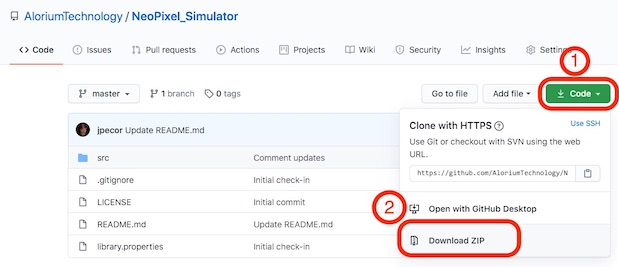
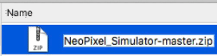

# NeoPixel_Simulator

NeoPixel_Simulator is an Arduino library designed to simulate the
behavior of a 12x12 NeoPixel array using the Arduino serial monitor. 

In the real-world array, there are 145 pixels numbered from 0 to 144, but
pixel 0 is a sacrificial pixel used as a voltage level converter, so the
pixels in the array are numbered from 1 to 144

Written by Bryan Craker of Alorium Technology.  
info@aloriumtech.com

The 12 x 12 array was created by Max Maxfield and is featured in  
his recent Ping Pong Array Simulator blog series.  Read more here:  
[12 x 12 Ping Pong Array Simulator (Part 2)](https://www.clivemaxfield.com/12-x-12-ping-pong-array-simulator-part-2/)

Then head over to YouTube and watch Max's most recent video  
demo of the 12 x 12 array and simulator:  
[12 x 12 NeoPixel Ping Pong Ball Array (Using the Simulator)](https://youtu.be/sbI0RxeLD40)

And if you are still hungry for even cooler beans than that, you can  
get your full at Max's Cool Beans Blog and YouTube channel.  
[Max's Cool Beans Blog](https://www.CliveMaxfield.com/coolbeans)  
[Max's Cool Beans Blog YouTube Channel](https://www.youtube.com/channel/UCQVqp_L4hKqF1uZ3tNo5MDw)

-------------------------------------------------------------------------

## Downloading Library

To download the NeoPixel_Simulator library for use with Arduino, follow
the following steps:

1. Click on the green "Code" button above
2. Select "Download ZIP"  
  
3. Find and unzip the downloaded ZIP file  
4. Change the unzipped directory name to remove the "-master"  
 
5. Move the NeoPixel_Simulator directory to your Arduino "libraries" folder.  This will generally be in "~/Documents/Arduino/libraries"
  
Now you are ready to start using NeoPixel_Simulator!

-------------------------------------------------------------------------

## NeoPixel_Simulator Usage:

NeoPixel_Simulator can be used by adding a define for the simulator and 
then adding an ifdef structure that  imports NeoPixel_Simulator and
redefines Adafruit_NeoPixel:

<pre><code>
#define SIMULATE_NEOS

#ifdef SIMULATE_NEOS
  #include &lt;NeoPixel_Simulator.h&gt;      
  #define Adafruit_NeoPixel NeoPixel_Simulator  
#else
  #include &lt;Adafruit_NeoPixel.h&gt;
#endif
</code></pre>

-------------------------------------------------------------------------

NeoPixel_Simulator is based on the Adafruit_NeoPixel library from Adafruit
Industries which can be found here:

[https://github.com/adafruit/Adafruit_NeoPixel](https://github.com/adafruit/Adafruit_NeoPixel)

Thanks Adafruit!  NeoPixels are awesome.

-------------------------------------------------------------------------

